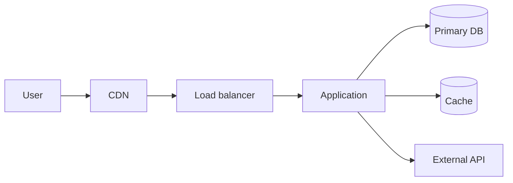

# Design Doc: <title>

<!--
Write the title as a noun phrase that says what will be done. Not
"Infra improvements" but "Upgrade the orders DB to MySQL 8.0" -
specific enough that a reader can find it in a list.
-->

| Item | Details |
| --- | --- |
| Status | Draft / In Review / Approved / Implemented / Superseded / Abandoned |
| Author | @<github-id> |
| Reviewers | @<github-id> (required), @<github-id> (optional) |
| Approver | @<github-id> |
| Created | YYYY-MM-DD |
| Last updated | YYYY-MM-DD |
| Related | Issue #, PR #, preceding Doc, follow-up Doc |
| Affected scope | Service name / environments (production, staging) / affected teams |

## TL;DR

<!--
Three lines at most. What, why, and by when.
Write for the reader who decides from this section alone (a director, another team's lead).
-->

## 1. Context and scope

<!--
Write only the background the reader does not already have. Cut what is already known.
- What the current setup looks like (diagram or bullets)
- How it got that way (historical reasons, if any)
- What the problem is. State it as observed facts ("p99 is 3.2s, SLO is 1.0s", not "slow")
- What happens, and when, if nothing is done
- What this Doc covers (which systems, which environments)
Stay neutral. Do not argue for a solution here.
-->

## 2. Goals and non-goals

### Goals

<!--
Write them so achievement can be measured. Not "make it stable" but "zero deploy-caused 5xx per month".
-->

-
-

### Non-goals

<!--
State explicitly what you would like to do but will not do this time. A Doc that is thin here
grows in scope during review and the discussion drifts.
-->

-
-

## 3. Assumptions and constraints

| Type | Details |
| --- | --- |
| Deadline | |
| Budget | |
| Constraints from the existing setup | |
| Organizational / staffing constraints | |
| Compliance requirements | |
| Things that cannot change | |

## 4. The actual design

### 4.1 System context diagram

<!--
First show, in one picture, where this change sits in the overall system.
Prioritize the boundaries with the outside (who calls it, what it calls) over internal detail.
-->

### 4.2 Components and responsibilities

| Component | Responsibility | Implementation (service / resource) | Owning team |
| --- | --- | --- | --- |
| | | | |

### 4.3 Interfaces and contracts

<!--
Describe the boundaries between components: APIs, queues, events, DB schemas.
If a change breaks compatibility, name who is affected.
-->

| Boundary | Protocol / format | Sync / async | Timeout | Retry | Idempotency |
| --- | --- | --- | --- | --- | --- |
| | | | | | |

### 4.4 Data

<!--
- Data stored and its classification (public / internal / personal data / payment data)
- Retention period and deletion method
- Consistency requirements (strong consistency needed, or is eventual enough)
- Schema change procedure (can it run online, does it take locks)
-->

| Data | Store | Classification | Retention | Encryption | Backup |
| --- | --- | --- | --- | --- | --- |
| | | | | | |

### 4.5 Configuration management

<!--
Where and how the configuration is managed: code, console operations, or a written procedure.
Draw the line between what must be reproducible and what need not be.
-->

| Item | Details |
| --- | --- |
| Management method | |
| Location (repository / directory) | |
| Change flow (who approves, what applies it) | |
| What remains manual | |
| Review and audit method | |

### 4.6 Environment differences

| Item | development | staging | production |
| --- | --- | --- | --- |
| Configuration | | | |
| Size/spec / count | | | |
| Data | | | |
| Why the difference is acceptable | | | |

### 4.7 Degree of constraint

<!--
Did existing constraints force this shape, or was it chosen from a blank slate?
If there are constraints, did you also consider removing the constraint itself?
Explain up front the places where a reviewer would ask "why not the simpler design?".
-->

## 5. Alternatives considered

<!--
At least two options. "Do nothing (status quo)" is always a valid alternative, so include it as a rule.
Write each option's trade-offs on equal footing, not reasons why the chosen one is better.
-->

| Option | Summary | Pros | Cons | Cost | Decision |
| --- | --- | --- | --- | --- | --- |
| Option A (chosen) | | | | | Chosen |
| Option B | | | | | Rejected |
| Option C: Do nothing | | | | | Rejected |

### Why this option

<!--
Write the one or two criteria that decided it. Not an overall score across every item,
but "this requirement exists, so B was out".
-->

## 6. Cross-cutting concerns

### 6.1 Reliability

#### SLI / SLO

<!-- Link to existing SLOs if any. If creating new ones, use 02-observability-slo.md alongside this. -->

| SLI | Definition (measurement method) | SLO | Current |
| --- | --- | --- | --- |
| | | | |

#### Failure modes and impact

<!--
For each element, write what happens when it breaks. This is the part of the Design Doc
that gets re-read most often later.
-->

| Failing component | What happens | Detection | Auto-recovery | Manual response | Severity |
| --- | --- | --- | --- | --- | --- |
| | | | | | |

#### Redundancy and disaster recovery

| Item | Details |
| --- | --- |
| Single points of failure | |
| Redundancy scope (zone / region) | |
| RTO (recovery time objective) | |
| RPO (acceptable data loss) | |
| Restore procedure verification status | Last performed: |

### 6.2 Operability

| Item | Details |
| --- | --- |
| Metrics | |
| Logs (destination / retention) | |
| Traces | |
| Dashboards | |
| Alerts (trigger conditions and destinations) | |
| Runbook | |
| On-call structure | |
| Routine operations (frequency / automation status) | |

### 6.3 Security and privacy

| Item | Details |
| --- | --- |
| Authentication / authorization | |
| Least privilege (permissions granted and why) | |
| Network boundary | |
| Secrets management | |
| Encryption in transit / at rest | |
| Audit logs | |
| Handling of personal / confidential data | |
| New attack surface | |

### 6.4 Performance and capacity

| Item | Current | Design value | Limit (what saturates first) |
| --- | --- | --- | --- |
| Request rate | | | |
| Latency | | | |
| Data volume / growth rate | | | |
| Concurrent connections | | | |

- Scaling method (horizontal / vertical, automatic / manual):
- Expected peak and its basis:

### 6.5 Cost

| Item | Current (monthly) | Target (monthly) | Delta | Estimate basis |
| --- | --- | --- | --- | --- |
| | | | | |

- One-time cost (including migration work and double running during the parallel period):
- How cost overruns are detected:

### 6.6 Compliance and audit

- Applicable policies or reviews:
- Required approvals:

## 7. Rollout plan

| Stage | Details | Scope | Exit criteria (to proceed) | Planned date |
| --- | --- | --- | --- | --- |
| 1 | | staging | | |
| 2 | | production (partial) | | |
| 3 | | production 100% | | |

### Rollback

<!--
Write it at an executable level of detail. "Revert the settings" is not enough.
Who does it, what do they operate, and how many minutes does it take? Can you still roll back after data has moved?
-->

| Item | Details |
| --- | --- |
| Rollback conditions | |
| Procedure | |
| Time required | |
| Point of no return | |
| Fallback if rollback is impossible | |

### Communication

| Audience | Message | Channel | Timing |
| --- | --- | --- | --- |
| | | | |

## 8. Verification plan

| Test | Purpose | Method | Pass criteria | Owner |
| --- | --- | --- | --- | --- |
| Functional check | | | | |
| Load test | | | | |
| Failure injection test | | | | |
| Restore test | | | | |
| Security check | | | | |

## 9. Risks and open questions

### Risks

| Risk | Likelihood | Impact | Mitigation | Accepted? |
| --- | --- | --- | --- | --- |
| | High/Medium/Low | High/Medium/Low | | |

### Open questions

<!-- Collect unresolved points raised in review here. Once decided, move them to the decision log. -->

| # | Question | Decision owner | Due | Status |
| --- | --- | --- | --- | --- |
| 1 | | | | Open |

## 10. Milestones and owners

| Milestone | Details | Owner | Due |
| --- | --- | --- | --- |
| | | | |

## 11. Decision log

<!-- Record only the conclusions. The discussion lives in the PR comments; do not repeat it. -->

| Date | Decision | Rationale | Decided by |
| --- | --- | --- | --- |
| | | | |

## 12. References

-
