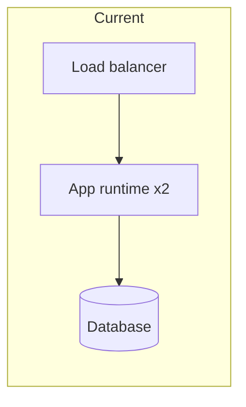
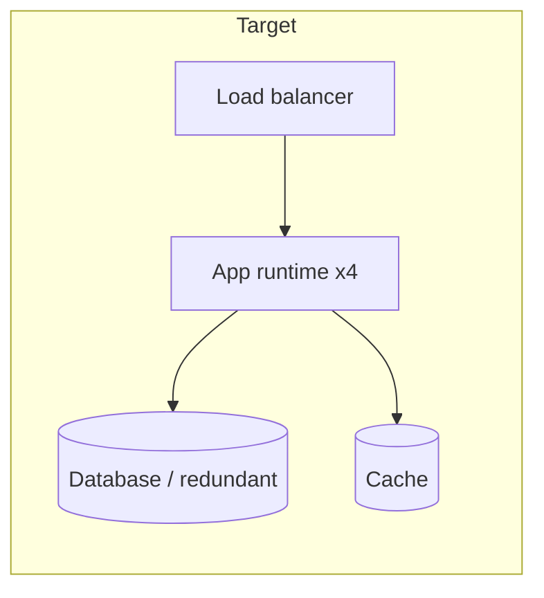

# Infra Change Doc: <title>

<!--
A derivative of 00-base-design-doc.md for configuration changes, new resources,
and architecture overhauls. The base covers cross-cutting concerns in more depth,
so use the base for changes with heavy decisions and this Doc for changes to an existing setup.
-->

| Item | Details |
| --- | --- |
| Status | Draft / In Review / Approved / Implemented |
| Author | @<github-id> |
| Reviewers / Approver | @<github-id> / @<github-id> |
| Created / Last updated | YYYY-MM-DD / YYYY-MM-DD |
| Target environments | production / staging / development |
| Target services | |
| Expected downtime | None / <n> minutes |
| Scheduled date and time | YYYY-MM-DD HH:MM JST |
| Related | Issue #, PR # |

## TL;DR

<!-- What changes, why, and when. Three lines at most. -->

## 1. Context

<!--
Why this change is needed now. State it as observed facts.
Examples: EOL deadline, cost overrun, SLO violation, capacity limit, audit finding.
-->

## 2. Goals and non-goals

### Goals

-

### Non-goals

-

## 3. Current (As-Is)

### Current resources

| Resource | Type | Size/spec | Count | Monthly cost | Notes |
| --- | --- | --- | --- | --- | --- |
| | | | | | |

### Current problems

| Problem | Supporting observation | Impact |
| --- | --- | --- |
| | | |

## 4. Target (To-Be)

### Target resources

| Resource | Type | Size/spec | Count | Monthly cost | New/Changed/Removed |
| --- | --- | --- | --- | --- | --- |
| | | | | | |

### Summary of differences

| Item | Current | Target | Reason for change |
| --- | --- | --- | --- |
| | | | |

## 5. Network

<!-- Only if the change touches the network. If it does not, write "No change". -->

| Item | Current | Target |
| --- | --- | --- |
| Networks and address ranges | | |
| Segment layout | | |
| Firewall rules | | |
| Routes (NAT / VPN / site-to-site / private connectivity) | | |
| DNS records | | |
| Certificates | | |
| Static IPs / where they are allowlisted | | |

- If IP addresses change, the parties that have them on an allowlist:

## 6. Alternatives considered

| Option | Summary | Pros | Cons | Monthly cost | Decision |
| --- | --- | --- | --- | --- | --- |
| Option A (chosen) | | | | | Chosen |
| Option B | | | | | |
| Option C: Do nothing (status quo) | | | | | |

### Why this option

## 7. Dependencies and impact

| Dependency (upstream / downstream) | Relationship | Impact | Coordination needed beforehand | Counterpart team |
| --- | --- | --- | --- | --- |
| | | | | |

- Conflicts with other teams' releases (freeze periods, campaigns, month-end processing):

## 8. Execution steps

<!--
Write at a level that can be copied and run. On the day, this section is the only one anyone looks at.
Attach a "verification" to every step. Running a step does not tell you whether it succeeded.
-->

### Preparation (by the day before)

| # | Task | Owner | Verification | Done |
| --- | --- | --- | --- | --- |
| 1 | Take a backup | | | [ ] |
| 2 | Notify stakeholders | | | [ ] |
| 3 | Dry run in staging | | | [ ] |

### Day of change

| # | Task | Command / operation | Owner | Duration | Verification |
| --- | --- | --- | --- | --- | --- |
| 1 | | | | | |
| 2 | | | | | |

### Post-change verification

| # | Check | Pass criteria | Owner |
| --- | --- | --- | --- |
| 1 | Error rate | Same level as before the change (5xx < 0.1%) | |
| 2 | Latency | p99 < <n> ms | |
| 3 | Logs | No new error logs | |
| 4 | Batch / async jobs | Next run completes successfully | |

## 9. Rollback

| Item | Details |
| --- | --- |
| Rollback decision maker | |
| Rollback conditions | |
| Procedure | |
| Time required | |
| Point of no return | |
| Monitoring period (declare complete once this has passed) | |

## 10. Risks

| Risk | Impact | Mitigation |
| --- | --- | --- |
| | | |

## 11. Handover to operations

| Item | Details |
| --- | --- |
| Monitoring to add or change | |
| Runbooks to add or change | |
| Routine operations that change | |
| Monitoring to remove / work no longer needed | |

<!-- Run through checklists/operational-readiness.md before handover. -->

## 12. References

-
