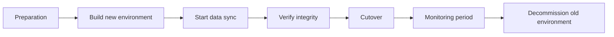

# Migration Doc: <migration target>

<!--
Use for infrastructure migrations, datastore migrations, version upgrades, and cutovers.
The core of a migration is not "building the new environment" but designing the
parallel run and the cutover, so this doc is weighted toward section 4 onward.
-->

| Item | Content |
| --- | --- |
| Status | Draft / In Review / Approved / Implemented |
| Author / Reviewers / Approver | @<github-id> / @<github-id> / @<github-id> |
| Created / Last updated | YYYY-MM-DD / YYYY-MM-DD |
| Source → Target | |
| Migration approach | Big-bang cutover / Phased migration / Parallel run with dual writes |
| Expected downtime | |
| Scheduled cutover | YYYY-MM-DD HH:MM JST |
| Deadline and why | YYYY-MM-DD (EOL / contract end / audit) |

## TL;DR

## 1. Background and deadline

<!--
Why migrate. If there is a deadline, state whether it can move.
A fixed deadline (end of support, contract end) constrains the whole plan.
-->

## 2. Goals and non-goals

### Goals

-

### Non-goals

<!--
Explicitly drop the things you will be tempted to do "while you're at it".
Mixing a migration with refactoring makes problems impossible to isolate.
-->

-

## 3. Migration inventory

<!--
Missed items come only from a coarse inventory. This is where completeness is guaranteed.
-->

| # | Item | Type | Size (rows / volume) | Approach | Order | Owner | Status |
| --- | --- | --- | --- | --- | --- | --- | --- |
| 1 | | Data / Config / Job / Permission | | | | | Not started |

### Out of scope for migration

| Item | Reason | Handling in source |
| --- | --- | --- |
| | | Delete / Retain |

### Dependency discovery

| Depends on the migration target | Form of dependency | Change required | Owning team |
| --- | --- | --- | --- |
| | Direct connection / DNS / Hardcoded | | |

<!-- List every place hostnames and connection details are written. This is the most common gap. -->

## 4. Choosing the migration approach

| Approach | Summary | Downtime | Ease of rollback | Implementation cost | Decision |
| --- | --- | --- | --- | --- | --- |
| Big-bang cutover | Stop and switch over | Large | High if the old environment is kept | Low | |
| Phased migration | Split the scope and move it in order | Small | Medium | Medium | |
| Parallel run with dual writes | Write to both, shift reads gradually | None | High | High | |

### Chosen approach and rationale

## 5. Migration plan

| Phase | Content | Duration | Exit criteria | Owner |
| --- | --- | --- | --- | --- |
| 1. Preparation | | | | |
| 2. Build new environment | | | | |
| 3. Data sync | | | | |
| 4. Verification | | | | |
| 5. Cutover | | | | |
| 6. Monitoring | | | | |
| 7. Decommission old environment | | | | |

## 6. Data migration and integrity

| Item | Content |
| --- | --- |
| Sync method (bulk / incremental / continuous replication) | |
| Handling of writes during migration | |
| Differences in character encoding, types, and time zones | |
| Measured migration time (from trial runs) | |

### Integrity verification

<!--
"Row counts matched" is often not enough. Write down what you compare and how.
-->

| Check | Method | Pass criteria | When |
| --- | --- | --- | --- |
| Row count match | | Exact match | Just before cutover |
| Sampled content comparison | | Zero differences across <n> samples | |
| Business-level reconciliation | | | |

### If inconsistencies are found

## 7. Cutover plan

<!--
This section is the plan at the level of phases and decision points, so reviewers
can argue about the decisions rather than the commands. Keep the command-level,
copy-and-paste runbook in a separate operations document and link it here.
-->

- Cutover runbook (command-level):

### Preparation

| # | Task | Owner | Due | Verification | Done |
| --- | --- | --- | --- | --- | --- |
| 1 | Dry run with production-equivalent data | | | | [ ] |
| 2 | Rehearse the rollback procedure | | | | [ ] |
| 3 | Notify stakeholders and users | | | | [ ] |
| 4 | Confirm day-of communication channels | | | | [ ] |

### Day-of timeline

| Time | Task | Owner | Duration | Verification |
| --- | --- | --- | --- | --- |
| T-30m | Confirm staffing, open monitoring dashboards | | | |
| T-10m | Write freeze / maintenance page | | | |
| T+0 | Final incremental sync | | | |
| T+? | Integrity verification | | | |
| T+? | Switch connection targets | | | |
| T+? | Connectivity check | | | |
| T+? | Reopen to traffic | | | |
| T+? | Post-cutover checks complete, stand down | | | |

### Decision points

| Time | Decision | Decision owner | Condition to proceed | Action if aborted |
| --- | --- | --- | --- | --- |
| | | | | |

## 8. Rollback

| Item | Content |
| --- | --- |
| Rollback triggers | |
| Procedure | |
| Time required | |
| Point of no return and its time | |
| Handling of problems found after that point | |
| Handling of delta data written to the target | |

## 9. Risks

| Risk | Likelihood | Impact | Mitigation | Detection |
| --- | --- | --- | --- | --- |
| | High/Medium/Low | High/Medium/Low | | |

## 10. Decommissioning the old environment

<!--
A migration is complete on the day the old environment is deleted, not the day the
new one started working. Leave this blank and you get double costs and forgotten assets.
-->

| Item | Content |
| --- | --- |
| Decommission criteria | |
| Retention period before deletion | |
| Planned decommission date | |
| What to decommission (resources, permissions, monitoring, jobs, documentation) | |
| Cost saved | |

## 11. Open questions

| # | Question | Decision owner | Due | Status |
| --- | --- | --- | --- | --- |
| 1 | | | | Open |

## 12. References

-
