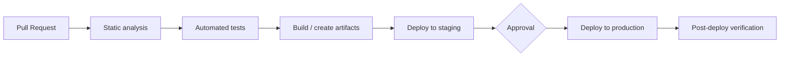

# CI/CD & Release Doc: <target>

<!--
Use for designing build, test, and deploy pipelines, changing the deployment strategy,
and revising the release flow.
-->

| Item | Content |
| --- | --- |
| Status | Draft / In Review / Approved / Implemented |
| Author / Reviewers / Approver | @<github-id> / @<github-id> / @<github-id> |
| Created / Last updated | YYYY-MM-DD / YYYY-MM-DD |
| Target repositories and services | |
| Affected developers | |

## TL;DR

## 1. Background

<!--
What is wrong with the current state. Use numbers where possible.
Example: 40 minutes per deploy, 15% failure rate, 20 minutes of manual work to roll back,
releases limited to once a week.
-->

### Current metrics

| Metric | Current | Target |
| --- | --- | --- |
| Deployment frequency | | |
| Lead time for changes (merge to production) | | |
| Change failure rate | | |
| Time to restore service | | |
| Pipeline duration | | |

<!-- The first four metrics follow the DORA definitions. https://dora.dev/ -->

## 2. Goals and non-goals

### Goals

-

### Non-goals

-

## 3. Pipeline design

### Stage definitions

| Stage | What runs | Trigger | Duration | On failure | Required/Optional |
| --- | --- | --- | --- | --- | --- |
| Static analysis | | PR opened or updated | | Block | Required |
| Automated tests | | | | Block | Required |
| Build | | | | Block | Required |
| Deploy to staging | | Merge to main | | Notify only | |
| Deploy to production | | | | | |

### Parallelism and caching

| Item | Content |
| --- | --- |
| Steps run in parallel | |
| Cached items and cache keys | |
| Cache invalidation conditions | |

## 4. Deployment strategy

| Strategy | Summary | Rollback time | Extra resources | Implementation cost | Decision |
| --- | --- | --- | --- | --- | --- |
| Rolling | Replace instances in sequence | Medium | None | Low | |
| Blue/Green | Build a separate environment and switch | Short | 2x | Medium | |
| Canary | Shift a portion of traffic in stages | Short | Little | High | |
| Recreate (with downtime) | Stop and replace | Medium | None | Low | |

### Chosen strategy and rationale

### Progressive delivery settings

| Stage | Traffic share | Wait time | Metrics evaluated automatically | Auto-abort condition |
| --- | --- | --- | --- | --- |
| 1 | 5% | 10 min | Error rate, p99 | Error rate > 1% |
| 2 | 50% | 10 min | | |
| 3 | 100% | — | | |

## 5. Handling database changes

<!--
This is almost always what makes a deploy hard to roll back.
Write on the assumption that schema changes and code changes are never released together.
-->

| Item | Content |
| --- | --- |
| When schema changes are applied | Before deploy / With deploy / After deploy |
| How backward compatibility is guaranteed | |
| Procedure for breaking changes (how to split into steps) | |
| Handling of slow-to-apply changes | |
| Handling of the schema on rollback | |

## 6. Permissions and approvals

| Operation | Who can run it | Approval | Audit log |
| --- | --- | --- | --- |
| Deploy to staging | | Not required | |
| Deploy to production | | | |
| Emergency deploy (bypassing the normal flow) | | | |
| Change pipeline configuration | | | |

### Handling of secrets

| Item | Content |
| --- | --- |
| Storage location | |
| How they are passed to the pipeline | |
| Preventing output to logs | |
| Rotation frequency and procedure | |
| Authentication method for external systems | |

## 7. Rollback and emergency response

| Item | Content |
| --- | --- |
| Rollback method | |
| Time required | |
| Who can run it (can on-call run it alone) | |
| Cases where rollback is not available | |
| Emergency release procedure (conditions for bypassing the normal flow, and follow-up) | |

## 8. Release observability

| Item | Content |
| --- | --- |
| Where deploy events are recorded | |
| How deploys are correlated with metrics | |
| Automated post-deploy checks | |
| Where failures are notified | |

## 9. Adoption plan (switching from the current flow)

<!-- If developer workflows change, include the communication plan as well. -->

| Stage | Content | Due | Owner |
| --- | --- | --- | --- |
| | | | |

- Communication to developers:
- When the old flow is retired:

## 10. Risks

| Risk | Impact | Mitigation |
| --- | --- | --- |
| | | |

## 11. Open questions

| # | Question | Status |
| --- | --- | --- |
| 1 | | Open |

## 12. References

- [DORA](https://dora.dev/)
- [BlueGreenDeployment](https://martinfowler.com/bliki/BlueGreenDeployment.html)
- [CanaryRelease](https://martinfowler.com/bliki/CanaryRelease.html)
