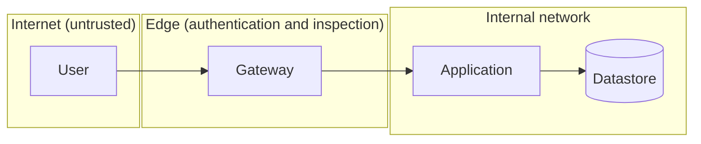

# Security / Access Design Doc: <target>

<!--
Use for permission design, network boundaries, secret management, and audit response.
If you skip threat enumeration (section 4) and start with the controls,
you will not be able to explain why those controls were chosen.
-->

| Item | Content |
| --- | --- |
| Status | Draft / In Review / Approved / Implemented |
| Author / Reviewers / Approver | @<github-id> / @<github-id> / @<github-id> |
| Created / Last updated | YYYY-MM-DD / YYYY-MM-DD |
| Target system | |
| Data classification | Public / Internal / Personal data / Sensitive personal data / Payment data |
| Related policies and audits | |

## TL;DR

## 1. Background and purpose

<!-- State what triggered this work: an audit finding, an incident, a new build, a policy revision. -->

## 2. Goals and non-goals

### Goals

-

### Non-goals

-

## 3. Assets to protect

| # | Asset | Type | Data classification | Storage location | Impact (if leaked / tampered with / lost) |
| --- | --- | --- | --- | --- | --- |
| 1 | | Data / Credentials / Keys / Config | | | |

## 4. Threat enumeration

<!--
List who, from where, could do what. Cover not only external attackers but also
mistakes by privileged internal users, lingering accounts of former employees,
and compromise of integrated third parties (supply chain).
-->

| # | Threat | Attacker / entry point | Impact | Current defense | Residual risk |
| --- | --- | --- | --- | --- | --- |
| 1 | | | | | |

### Trust boundaries

| Boundary | Allowed traffic | Authentication and authorization | Inspection and restrictions |
| --- | --- | --- | --- |
| | | | |

## 5. Authentication and authorization

| Item | Content |
| --- | --- |
| Authentication method (users / service-to-service) | |
| Scope of multi-factor authentication | |
| Identity source of truth | |
| Session lifetime | |
| Service-to-service authentication (how long-lived credentials are avoided) | |

### Permission model

<!--
Least privilege means more than granting only the permissions needed; it means being
able to explain why each permission is needed. Do not leave the rationale column empty.
-->

| Role | Granted to (people / systems) | Can do | Cannot do | Why needed | Access review cadence |
| --- | --- | --- | --- | --- | --- |
| | | | | | |

### Privileged access

| Item | Content |
| --- | --- |
| Privileged people and roles | |
| Standing grant or granted only when needed | |
| Elevation request and approval procedure | |
| How operations are recorded | |
| Handling of direct access to production data | |

## 6. Network

| Item | Content |
| --- | --- |
| Public entry points and exposure | |
| Internal traffic paths | |
| Source restrictions (allowlist) | |
| Egress restrictions | |
| Paths for administrative and operational access | |

## 7. Secrets and encryption keys

| Secret | Purpose | Storage location | Who can access | Rotation | Procedure if leaked |
| --- | --- | --- | --- | --- | --- |
| | | | | | |

| Item | Content |
| --- | --- |
| Encryption at rest | |
| Encryption in transit | |
| Key management owner | |
| Handling in development environments (how production values are kept out) | |

## 8. Logging and audit

| Item | Content |
| --- | --- |
| Operations recorded | |
| Storage location and retention period | |
| Tamper resistance | |
| Who can read the logs | |
| How sensitive data is kept out of logs | |
| Anomaly detection | |

## 9. Alternatives

| Option | Summary | Pros | Cons | Operational load | Decision |
| --- | --- | --- | --- | --- | --- |
| | | | | | |

### Rationale

<!--
Security design is a trade-off against operational load.
A design that operations cannot sustain gets bypassed, so be honest here.
-->

## 10. Accepted risks

<!--
Not everything can be closed. State explicitly what you decided not to close, and who approved it.
A doc with this section empty cannot show whether the risks were never considered or all closed.
-->

| Risk | Why not closed | Compensating controls | Acceptance approver | Review date |
| --- | --- | --- | --- | --- |
| | | | | |

## 11. Incident response

| Event | First response | Decision owner | Contact | Runbook |
| --- | --- | --- | --- | --- |
| Credential leak | | | | |
| Suspicious access detected | | | | |
| Permission granted in error | | | | |

## 12. Adoption plan and recurring tasks

| Task | Content | Owner | Due / Cadence |
| --- | --- | --- | --- |
| Adoption | | | |
| Access review | | | Quarterly |
| Credential rotation | | | |

## 13. Open questions

| # | Question | Status |
| --- | --- | --- |
| 1 | | Open |

## 14. References

- [Google Cloud Architecture Framework: Security](https://cloud.google.com/architecture/framework/security)
