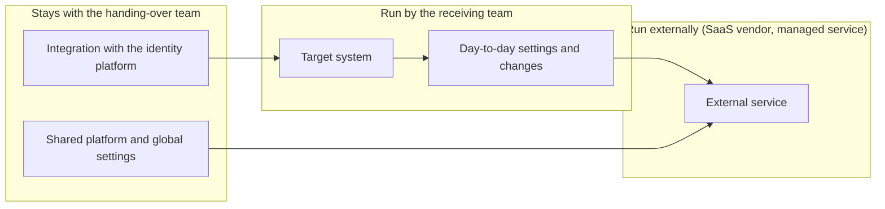

# Operations Handover Doc: Hand over operations of <system name> to <team name>

<!--
Doc for handing over the operation of a system, platform, or SaaS from the team running it
today (handing-over team) to another team (receiving team), so the receiving team can run it on their own.

The goal is not to hand off tasks but for the receiving team to operate autonomously, including the judgment calls.
The handing-over team acts as an enabling team and withdraws in stages.
By the time this Doc is finished, the date the handing-over team steps back and the criteria for it must be decided.

When to use:
- If the receiving team already runs something similar and every task being handed over is procedural,
  this Doc is not needed. Just go through checklists/operational-readiness.md
- Write this Doc if any of these apply: some tasks require judgment, the receiving team has no experience,
  or requests are piling up on the handing-over team. Use the same checklist for the final check
- If you are still deciding the design or selection of the target, use 00-base-design-doc.md or 07-adr.md
-->

| Item | Content |
| --- | --- |
| Status | Draft / In Review / Approved / In Progress / Completed |
| Author (handing-over team) | @<github-id> |
| Receiving team point of contact | @<github-id> |
| Reviewers / Approver | @<github-id> / @<github-id> |
| Created / Last updated | YYYY-MM-DD / YYYY-MM-DD |
| Target system / platform | |
| Type | In-house system / Platform / SaaS / Combination |
| Receiving team | |
| Start date | YYYY-MM-DD |
| Planned step-back date | YYYY-MM-DD |
| Related | Issue #, Design Doc from the build, ADR from the selection |

## TL;DR

<!-- What operations, to which team, by when. What stays with the handing-over team afterward. 3 lines or fewer. -->

## 1. Background and purpose

<!--
Why hand over these operations now. Write in facts.
Examples: the handing-over team spends n hours a week on requests from the receiving team,
the receiving team cannot change settings themselves and lead time is n days,
only one specific person on the handing-over team understands it.
Lead with the problems happening now, not with how things "should" be.
-->

### Who the current operations depend on

| Task | Who handles it today | Time from request to completion | Times per month |
| --- | --- | --- | --- |
| | | | |

## 2. Goals and non-goals

### Goals

<!--
Write in the form "the receiving team can decide and carry out X on their own".
"Write documentation" and "hold a study session" are means, not goals.
-->

-

### Non-goals

<!--
State explicitly what the handing-over team keeps and what is not handed over.
Examples: contract renewals, company-wide settings, point of contact with the SaaS vendor.
-->

-

## 3. Overview of operations

### System layout and who operates what

<!-- Make a diagram that shows which part is operated by whom. Include the responsibility of external parties (SaaS, managed services). -->

### Division of responsibilities

<!--
Show before and after side by side. Distinguish "consult", "execute", and "approve".
Do not forget the column for external parties (SaaS vendor, cloud managed services).
This is where areas that can only be resolved by "asking the vendor" during an incident become visible.
-->

| Task / decision | Before handover | After handover | External (vendor, etc.) |
| --- | --- | --- | --- |
| Day-to-day setting changes | Handing-over team | Receiving team | — |
| First response to alerts | | | |
| Granting and revoking access | | | |
| Checking usage and cost | | | |
| Inquiries during incidents | | | Responds |
| Contract renewals and upgrade policy | Handing-over team | Handing-over team | — |

## 4. Inventory of operations to hand over

<!--
List every task being handed over. If this is rough, "tasks nobody mentioned" surface later
and end up back with the handing-over team.
Three levels of difficulty are enough: "follow the procedure", "judgment based on the situation", "understanding of the design".
-->

### Routine operations

| # | Task | Frequency | Difficulty | Training material / Runbook | Status |
| --- | --- | --- | --- | --- | --- |
| 1 | | | Procedural / Judgment / Design | | Not started / Explained / Done together / Independent |

### Incident and anomaly response

| # | Event | Detection | First response | Judgment calls | Training material / Runbook | Status |
| --- | --- | --- | --- | --- | --- | --- |
| 1 | | | | | | |

### Changes

| # | Task | Origin (whose request triggers it) | Difficulty | Approval required | Training material / Runbook | Status |
| --- | --- | --- | --- | --- | --- | --- |
| 1 | | | | | | |

### Periodic tasks

| # | Task | Frequency | Deadline | Notification mechanism | Training material / Runbook | Status |
| --- | --- | --- | --- | --- | --- | --- |
| 1 | Access review | Quarterly | | | | |
| 2 | Checking usage and cost | Monthly | | | | |

### Tasks that stay with the handing-over team

| Task | Why it stays | How to request |
| --- | --- | --- |
| | | |

## 5. Current state of the receiving team

<!--
Interview them and write it down. Do not fill this in from the handing-over team's assumptions.
Skip this and the training material will be at the wrong level: explained, but not retained.
-->

| Item | Content |
| --- | --- |
| Experience with the target system and the SaaS in use | |
| Prerequisite knowledge (auth, networking, domain concepts) | |
| Experience with similar operations | |
| Time available for the handover (per week) | |
| Team concerns | |
| What the team expects from this handover | |
| Point of contact, and the backup if they leave | |

## 6. Accounts and access

| Item | Content |
| --- | --- |
| Authentication method (SSO or not) | |
| How accounts are issued and by whom | |
| Removal flow on leaving or transfer | |
| Roles handed to the receiving team and what they allow | |
| Permissions not handed over, and why | |
| Where permission changes are recorded | |
| How to view audit logs | |

## 7. Cost handling

| Item | Content |
| --- | --- |
| How cost is incurred (fixed resources / usage-based / per seat) | |
| Who pays for the receiving team's usage | |
| Current monthly cost and estimate after handover | |
| Limits (resources, seats, usage) and who decides when close to exceeding them | |
| Where and how often to check usage | |

## 8. Handover approach (enabling)

<!--
Reduce involvement in stages.
Jumping straight to "here are the docs, please read them" gets you questions instead of readers.
Give each phase an exit condition. Divide by time alone and you move on before things are done.
-->

| Phase | Handing-over team | Receiving team | Period | Exit condition |
| --- | --- | --- | --- | --- |
| 1. Show | Explain the overall picture and design intent. Demonstrate the actual work | Ask questions. Learn the terms and the layout | | The receiving team can explain the division of responsibilities table |
| 2. Do together | Pair on the work. Say the reasoning behind decisions out loud | Do the hands-on work | | Every task in the inventory done together at least once |
| 3. Observe | Receiving team leads. Answer questions | Do it alone and report the results | | Main tasks done alone n times with no rework |
| 4. Step back | Point of contact for inquiries only | Operate autonomously | | Exit criteria met |

### Methods

| Method | When to use | Date / frequency | Owner |
| --- | --- | --- | --- |
| Design walkthrough | Phase 1 | | |
| Hands-on session | Phases 1 to 2 | | |
| Pairing / mob sessions | Phase 2 | | |
| Incident response drill | Phases 2 to 3 | | |
| Office hours (recurring slot for questions) | Phases 3 to 4 | | |
| Retrospective | End of each phase | | |

### Schedule

| Week | Content | Owner | Status |
| --- | --- | --- | --- |
| | | | |

## 9. Training material and Runbooks

<!--
List them and decide the owner after handover.
If the owner stays with the handing-over team, the receiving team cannot update them and keeps using stale procedures.
-->

| Document | Type | Location | Phase | Owner after handover | Status |
| --- | --- | --- | --- | --- | --- |
| Architecture diagram and design intent | Explanatory material | | 1 | | |
| Routine operations Runbook | Procedure | | 2 onward | Receiving team | |
| Incident response Runbook | Procedure | | 2 onward | Receiving team | |
| Frequently asked questions | FAQ | | 3 onward | Receiving team | |
| Which parts of the official docs to read | Link list | | 1 | | |

### Operating rules

<!-- Rules the receiving team follows when changing settings themselves: naming conventions, tags, where to record changes, whether review is required, etc. -->

| Rule | Content | Reason |
| --- | --- | --- |
| | | |

## 10. Exit criteria

<!--
Conditions for the handing-over team to stop being involved. Write observable facts, not dates.
If not met, extend. Decide in advance who makes the call to extend.
-->

| # | Criterion | How to verify | Met |
| --- | --- | --- | --- |
| 1 | Every task in the inventory is "Independent" | Status column in section 4 | [ ] |
| 2 | Incident response drill completed by the receiving team alone | Drill record | [ ] |
| 3 | Zero escalations to the handing-over team in the last n weeks | Inquiry log | [ ] |
| 4 | Ownership of Runbooks and FAQ has moved to the receiving team | Section 9 | [ ] |
| 5 | At least two people on the receiving team can handle it | Interview | [ ] |

- Who decides on extension if the criteria are not met:

<!-- Before stepping back, go through checklists/operational-readiness.md together with the receiving team. -->

## 11. Support after handover

| Item | Content |
| --- | --- |
| Point of contact for inquiries (channel, Issue) | |
| Expected response time | |
| Scope the handing-over team handles | |
| Escalation path (including the SaaS vendor) | |
| Support end date and what happens after | |
| Frequency and timing of regular retrospectives | |

## 12. Measuring adoption

<!--
Measure not just usage but whether the problems listed in section 1 are gone.
-->

| Metric | Before handover | Target | How to measure | When to check |
| --- | --- | --- | --- | --- |
| Requests to the handing-over team (per month) | | | | |
| Lead time for setting changes | | | | |
| Share of incidents handled by the receiving team alone | | | | |
| | | | | |

## 13. Tracking external changes

<!--
The system changes even if nobody touches it: SaaS spec changes and price revisions,
managed service version EOL, dependency updates, contract renewals.
Decide who notices and who acts. Delete rows that do not apply.
-->

| Change | Detection | First to check | How to inform the receiving team |
| --- | --- | --- | --- |
| SaaS feature changes or removals | Release notes | | |
| Pricing or plan changes | Vendor notice | | |
| Managed service / middleware EOL | Provider notice, EOL list | | |
| Contract renewal | Renewal date notice | Handing-over team | |
| External outages and maintenance | Status page | | |

## 14. Risks

| Risk | Warning sign | Mitigation |
| --- | --- | --- |
| Receiving team cannot secure time and phases stall | Schedule slips | Agree on weekly hours before starting and share with their manager |
| Knowledge concentrates in the single point of contact | Inquiries arrive when that person is out | Include "two or more owners" in the exit criteria |
| Requests keep coming back to the handing-over team after stepping back | Request count does not drop | Treat each request as a Runbook gap and have the receiving team update it |
| Permissions handed over are too broad | Unintended setting changes | Narrow the roles and decide where changes are recorded |

## 15. Open questions

| # | Question | Decided by | Due | Status |
| --- | --- | --- | --- | --- |
| 1 | | | | Open |

## 16. References

- [Team Topologies: Key Concepts](https://teamtopologies.com/key-concepts) — where the enabling team fits
- [Evolving SRE Engagement Model (SRE book)](https://sre.google/sre-book/evolving-sre-engagement-model/) — changing the depth of involvement in stages
